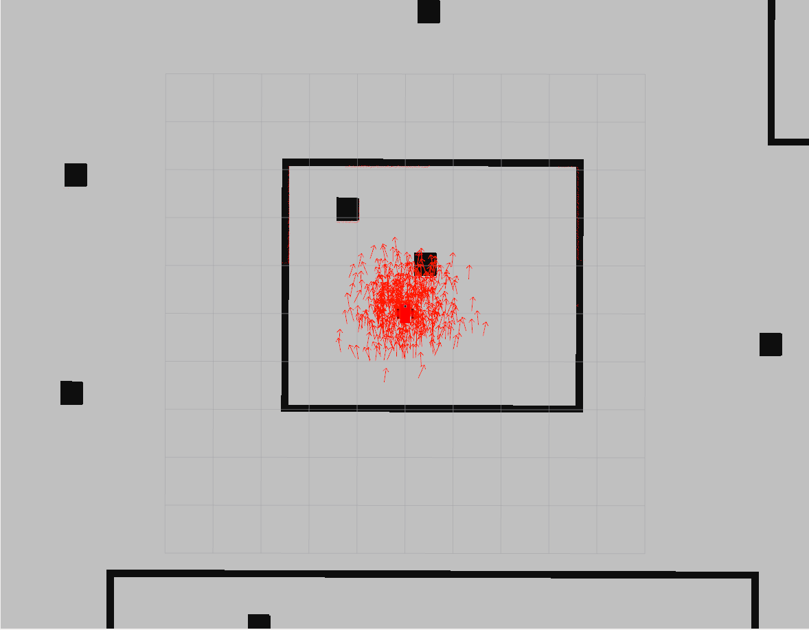
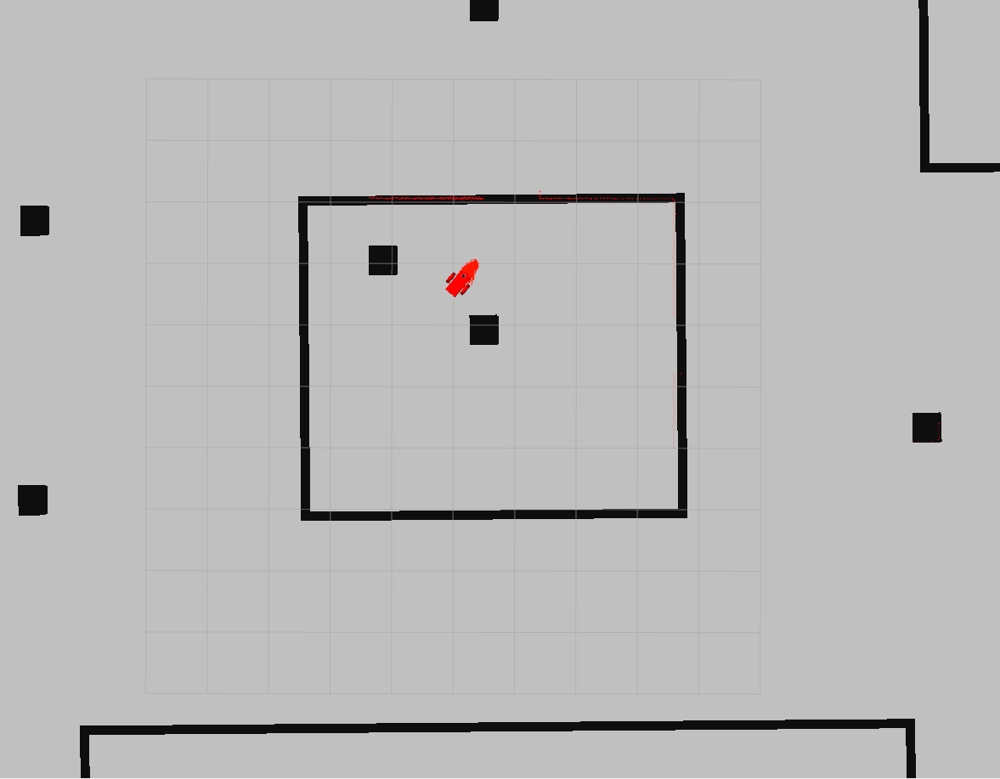
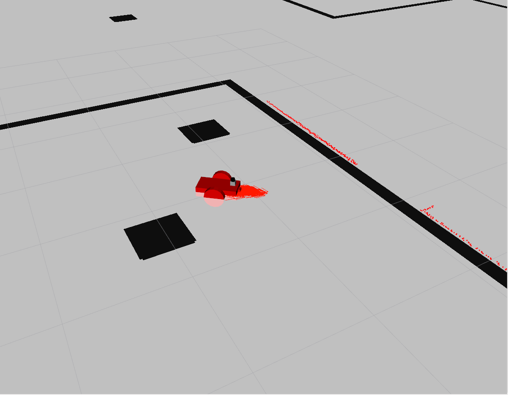

# Where Am I???

### Dependencies

* [ROS Kinetic](http://wiki.ros.org/kinetic)
* [Gazebo for ROS Kinetic](http://gazebosim.org/tutorials?tut=ros_installing&cat=connect_ros)
* [pgm_map_creator](https://github.com/hyfan1116/pgm_map_creator) (To create the overlay of map)
	0. `sudo apt-get install libignition-math2-dev protobuf-compiler`
	1. `cd PATH_TO/Where_Am_I/src`
	2. `git clone https://github.com/udacity/pgm_map_creator.git`
	3. `cd ..`
	4. `catkin_make`
* ros-teleop:
	1. `cd PATH_TO/Where_Am_I/src`
	2. `git clone https://github.com/ros-teleop/teleop_twist_keyboard`
	3. `cd ..`
	4. `catkin_make`

### Overview
Utilize Monte Carlo Localization with ROS AMCL package to localize a robot. You will be able to see how the overlayed map will match the actual match once the robot gets localized.

#### Goal
The goal of this project is to localize the the robot on it's map 

### How to run it
 
1. Clone this repo: `git clone https://github.com/martinezedwin/Go_Chase_It`
2. Install ROS and Gazebo (from the project directory `chmod +x setup.sh && ./setup.sh`)
3. Install ros-teleop (see commands under Dependencies)
4. run the run_world_1.sh script: `chmod + x run_world_1.sh && ./run_world.sh`. 
5. run the get ball script to have the robot look for and chase the ball: `chmod + x amcl_2.sh && ./amcl_2.sh`
6. Control the bot: `chmod + x teleop_3.sh && ./teleop_3.sh`

### Results
Once the project is running you will see an unlocalized robot in Rviz:

Note: The arrows are scattered

After moving for a bit, the robot quickly localizes:

|   Top View            |    Side View      |
|---------------|----------|
|| |

Note: How the arrows converged

	

