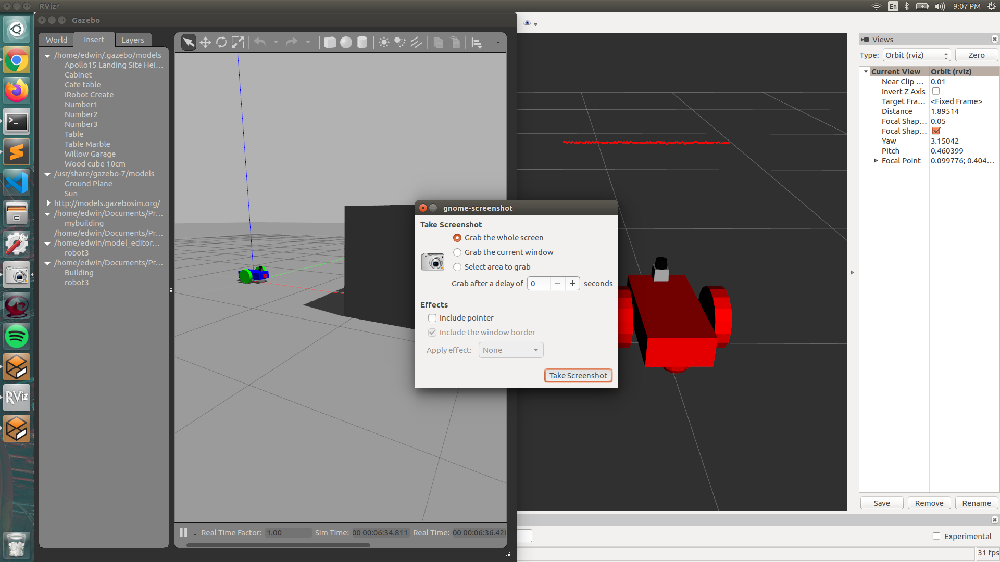

# Go Chase It!!!!

### Overview
This project was created usign Ubuntu 16.04 LTS along with ROS 1 and Gazebo

It was built on top of the [myworld project](https://github.com/martinezedwin/myworld) for the gazebo world. The myworld project also goes over how to install ROS and Gazebo taht could be used for this project as well.

### How to run it

1. Install ROS (see myworld project above)
2. Install Gazebo (see myworld project above)
3. Clone this repo: `git clone https://github.com/martinezedwin/Go_Chase_It`
4. run the run_world_1.sh script: `chmod + x run_world_1.sh && ./run_world.sh`. 
5. run the get ball script to have the robot look for and chase the ball: `chmod + x get_ball_2.sh && ./get_ball_2.sh`
6. Move the ball within the gazebo world wall so the robot can see it.
7. (Optional) See what the robot sees: `chmod + x visualize_cam_3.sh && ./visualize_cam_3.sh`

